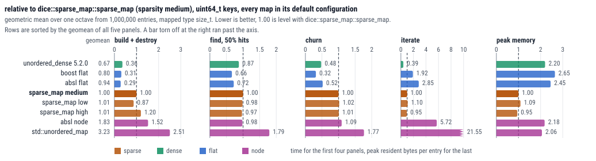
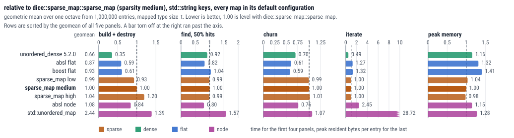
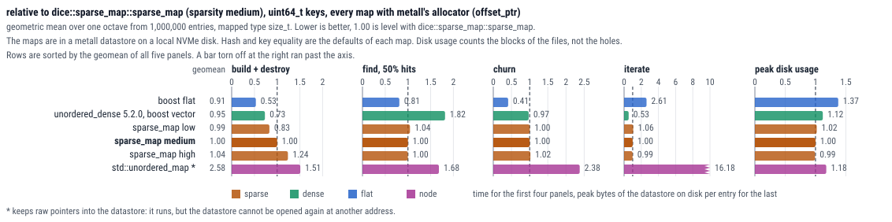
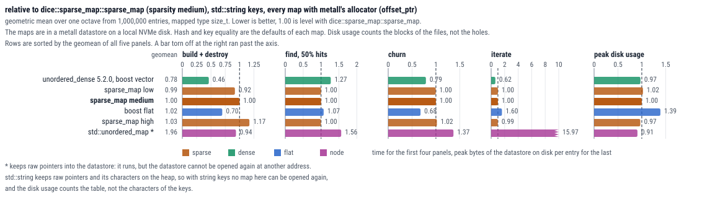

# unordered_sparse -- A hash table (almost) at vector size

`dice::sparse_map` and `dice::sparse_set` are hash tables for C++23 that need little more memory than a `std::vector` of the same elements.

- **Memory efficient:** only about 20 % more memory than a `std::vector` of the same elements (15 to 26 % measured for elements of 16 bytes, less for larger ones, see the [benchmarks](#benchmarks)). The peak during a build is at most about 5 % higher.
- **mmap-able to disk:** supports persistent allocators like [metall](https://github.com/LLNL/metall) through fancy pointers. The map, the set and their elements are standard layout.
- **Rich C++29 interface** like `std::unordered_map` and `std::unordered_set` (see the [differences](doc/usage.md#differences-compared-to-stdunordered_map)).

Compromises:

- **Speed traded for memory:** lookups, insertions and iteration are slower than in flat and dense maps like `ankerl::unordered_dense::map` (see the [benchmarks](#benchmarks)).
- **Needs a good hash function:** the bucket comes from the low bits of the hash. A hash function that is not marked as avalanching is mixed first (see [hash functions](doc/usage.md#hash-functions)).
- **Exception safety:** if a rehash of elements with a `noexcept` move constructor throws (the allocator or the hash function), the exception reaches the caller and the map is empty, so refill it or drop it. Elements whose move can throw are copied and stay unchanged.

## Usage

The library is header-only and needs C++23 (tested with GCC 14 and Clang 19 and 20).

```c++
#include <dice/unordered_sparse.hpp>

#include <iostream>
#include <ranges>
#include <string>

int main() {
    dice::sparse_map<std::string, int> map = {{"a", 1}, {"b", 2}};
    map["c"] = 3;
    map.erase("a");

    // C++23: build the set from a range, the element type is deduced
    dice::sparse_set const wanted(std::from_range, std::views::single(2));

    for (auto const &[key, value] : map) {
        if (wanted.contains(value)) {
            std::cout << key << ' ' << value << '\n';  // b 2
        }
    }
}
```

With CMake, for example from the conan package `dice-unordered-sparse` of the [DICE conan remote](https://conan.dice-research.org/artifactory/api/conan/tentris):

```cmake
find_package(dice-unordered-sparse REQUIRED)
target_link_libraries(your_target PRIVATE dice-unordered-sparse::dice-unordered-sparse)
```

## Benchmarks

Relative to `dice::sparse_map` (1.00), lower is better. The first two plots use `std::allocator`, the last two the metall allocator. [doc/benchmarks.md](doc/benchmarks.md) has the long version.









With `uint64_t` keys, `dice::sparse_map` needs less than half the peak memory of every other map in the plots. Its lookups are as fast as in `unordered_dense` (the other flat maps need 0.75 to 0.84 of its time), and its inserts and erases take 2 to 3.5 times as long as in the flat maps. With `std::string` keys the other maps need 15 % to 41 % more peak memory. With metall's allocator the last panel is the peak disk usage of the datastore, and the gap is smaller: `unordered_dense` needs 12 % and `boost::unordered_flat_map` 38 % more (`uint64_t` keys).

[doc/benchmarks.md](doc/benchmarks.md#allocated-memory-over-time) also plots the allocated memory over time while 10 million `uint64_t` pairs are inserted: `dice::sparse_map` peaks at 194 MB, the other maps at 253 to 495 MB.

## Documentation

- [Usage](doc/usage.md): the interface, the differences to `std::unordered_map`, hash functions, sparsity, exception safety, allocators and metall.
- [Design](doc/design.md): how the table works, and its persisted format.
- [Benchmarks](doc/benchmarks.md): what the plots measure, how they were taken, the raw numbers.
- [Upgrading from 0.3](doc/upgrading-from-0.3.md): what changed since 0.3.

## License

MIT ([LICENSE-dice-sparse-map](LICENSE-dice-sparse-map)).

Based on [tsl::sparse_map](https://github.com/Tessil/sparse-map) by Thibaut Goetghebuer-Planchon (MIT, [LICENSE-tsl-sparse-map](LICENSE-tsl-sparse-map)).

Taken from [ankerl::unordered_dense](https://github.com/martinus/unordered_dense) by Martin Leitner-Ankerl (MIT, [LICENSE-unordered-dense](LICENSE-unordered-dense)): the marker `is_avalanching` and the mixer for other hash functions, the test fixtures and many tests (`tests/fixtures/`, `tests/tests_ud_*.cpp` and the other files that say so), the benchmarks in `benchmarks/`, and the five panels of the plots above.
