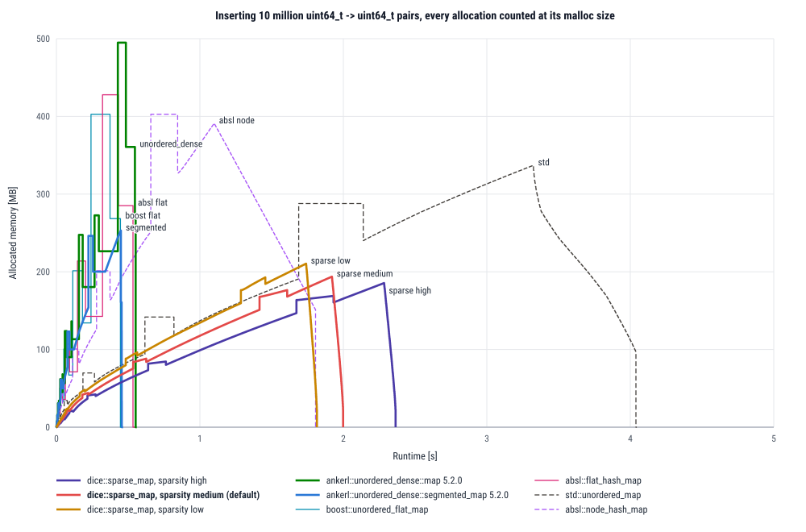

# Benchmarks

The long version of the plots in the [README](../README.md). `dice::sparse_map::sparse_map` against
`ankerl::unordered_dense::map`, `std::unordered_map`, `boost::unordered_flat_map`,
`absl::flat_hash_map` and `absl::node_hash_map`, with `uint64_t` and `std::string` keys, once with
`std::allocator` and once with metall's allocator. The panels and the way they are measured follow
the README benchmark of [ankerl::unordered_dense](https://github.com/martinus/unordered_dense).
The [last section](#allocated-memory-over-time) has one more plot, in MB and seconds: the memory
that each map allocates over time while 10 million entries are inserted.

Everything is relative to `dice::sparse_map::sparse_map<Key, std::size_t>` with the default sparsity medium:
1.00 is level with it, 2.00 is twice the cost. The programs are in
[benchmarks/readme](../benchmarks/readme/README.md).

## With `std::allocator`


| panel | one operation is | `sparse_map<uint64_t, size_t>` | `sparse_map<std::string, size_t>` |
|---|---|---|---|
| build + destroy | one insert into an empty map, nothing reserved, plus its share of destroying the map | 53.2 ns | 299 ns |
| find | one lookup, half of them for keys in the map | 30.9 ns | 143 ns |
| churn | one erase plus one insert of a key that is not in the map, at a fixed size | 115 ns | 609 ns |
| iterate | one element of a full pass, summing the mapped value | 0.972 ns | 2.61 ns |
| peak memory | one entry's share of the highest resident set while building, baseline subtracted | 22.1 bytes | 106 bytes |

The `geomean` column is only the sort key. The axis of `iterate` ends at 10 and the other axes at
4. A bar that runs past the axis is drawn torn off, with its real value next to it.

### Memory is what the sparse layout buys, inserts and erases are what it costs

**Peak memory.** With `uint64_t` keys a `sparse_map` entry costs 22.1 bytes of peak resident memory. The flat maps need 2.20x (`unordered_dense`) to 2.65x (`boost`) of that, the node maps 2.06x and 2.18x. Counted as bytes requested from the heap (`memory` in the CSV), it is 19.2 bytes per entry against 40.5 to 48.0, for an entry of 16 bytes. Two things keep it small. A group of 64 buckets stores only its occupied buckets, so an empty bucket costs half a byte (its two bits and its share of the group header). And a rehash moves one old group after the other and frees each old group right after, so the values are never in memory twice. A flat map that doubles holds its old and its new array at the same moment, and with the 64 MiB trim threshold of this harness the old array stays resident after it is freed. With `std::string` keys the keys themselves take about 100 bytes per entry for every map (the `std::string`, the `size_t` and on average 60 bytes of characters on the heap). `sparse_map` needs 106 bytes, the others 1.15x to 1.41x of that.

**Find.** A `uint64_t` lookup takes 30.9 ns. `boost` needs 0.66 of that, `absl` 0.72, `unordered_dense` 0.87, `absl node` 0.98 and `std::unordered_map` 1.79. With `std::string` keys `sparse_map` takes 143 ns. `absl node` needs 0.80 of that, `absl` 0.82, `unordered_dense` 0.92, `boost` 1.04 and `std::unordered_map` 1.57. A probe of `sparse_map` compares the key of every occupied bucket it visits, while the flat maps first compare a one byte fingerprint. With strings, a key comparison reads the characters on the heap. Every map has its own string hash: `sparse_map` uses `dice::hash::DiceHash` with wyhash, `std::unordered_map` uses `std::hash<std::string>`. The sparsity does not change a lookup.

**Build and churn.** One insert plus its share of the destructor takes 53.2 ns with `uint64_t` keys. The flat maps need 0.29 to 0.36 of that, `absl node` 1.52 and `std::unordered_map` 2.51. With strings it is 299 ns, the flat maps need 0.35 (`unordered_dense`) to 0.61. An insert into a group moves the values behind the new one by one place, and when the values array of the group is full, it allocates a larger one (4 more slots with sparsity medium) and moves all values of the group. A flat map writes one slot. `churn` (one erase plus one insert at a fixed size) costs 115 ns with `uint64_t` keys, and the flat maps need 0.32 to 0.52 of that. An erase moves the values behind the erased one to the front and leaves a deleted bucket. When the elements and the deleted buckets reach 75% of the buckets, the map rehashes to clear the deleted buckets.

**Iteration.** A full pass costs 0.972 ns per element with `uint64_t` keys. `sparse_map` walks the groups and reads the values of each group from one array. `unordered_dense` keeps all values in one array and needs 0.39 of that. `boost` needs 1.92, `absl` 2.85, `absl node` 5.72 and `std::unordered_map` 21.6. With strings the values are 40 bytes instead of 16. `unordered_dense` needs 0.49, `absl` 1.27 and `boost` 1.32.

## With metall's allocator


metall's allocator has `boost::interprocess::offset_ptr` as its pointer type. A map works with it
only if it allocates through `std::allocator_traits` and stores the pointers it gets. It is
relocatable only if it stores no raw pointer at all, so that the datastore can be opened again at
another address. `check/dsm_readme_api_*` uses the common map interface once with each map, and
`check/dsm_readme_relocate` builds every map with `uint64_t` keys in a datastore, opens the
datastore again in a new process at another address, and checks a filled and an empty map, also
with new inserts.

| map | runs with metall | relocatable | why |
|---|---|---|---|
| `dice::sparse_map::sparse_map`, all three sparsities | yes | yes | stores only the allocator's pointers |
| `ankerl::unordered_dense::map` 5.2.0 with `metall::container::vector` as value container | yes | yes | the fifth template parameter takes a container. The group array is a `std::vector` with the rebound metall allocator, which keeps `offset_ptr` too. |
| `ankerl::unordered_dense::map` 5.2.0 with metall's allocator | partly | not checked | the value container is a `std::vector`. `operator[]` and `operator->` of the iterator do not compile: libstdc++'s vector iterator cannot return an `offset_ptr` as a raw pointer. Not in the plots. |
| `boost::unordered_flat_map` 1.91 | yes | yes | Boost.Unordered supports fancy pointers in its open addressing containers. An empty map is relocatable too. |
| `std::unordered_map` (libstdc++ 14) | yes | no | libstdc++ turns the allocator's pointer into a raw pointer (`std::__to_address`) and keeps raw pointers to its nodes and buckets. It runs in one process. Opened at another address, the check crashes with a segmentation fault. Marked with a star in the plots. |
| `absl::flat_hash_map`, `absl::node_hash_map` 20250814.2 | no | no | `raw_hash_set.h` rejects the allocator: `static_assert` "Allocators with custom pointer types are not supported". Not in the plots. |

With `std::string` keys no map is relocatable. A `std::string` keeps a raw pointer, to its own
buffer or to its characters on the heap. The string plot shows what the maps cost in a datastore,
not a map that can be opened again.

### Results with metall

**Peak disk usage.** With metall the last panel is the disk usage of the datastore: the blocks that its files occupy at the highest point of the build, minus an empty datastore. A hole that metall punched into a file costs nothing. With `uint64_t` keys a `sparse_map` entry takes 32.0 bytes on disk at the peak and 31.8 bytes after the build. `unordered_dense` needs 1.12x of that, `boost` 1.37x and `std::unordered_map` 1.18x. With `uint64_t` keys the peak resident set (`rss` in the CSV) is within 0.2 bytes per entry of its peak disk usage, for every map: the resident part of a map in metall is the written pages of the datastore.

So the difference between the maps is much smaller than with `std::allocator` (2.06x to 2.65x), for two reasons. First, the live blocks of `sparse_map` take 18.6 bytes per entry in metall (`metallobjects`), about the 19.2 bytes it requests from glibc, but its datastore holds 31.8. metall serves a small block from a chunk of 2 MiB that holds blocks of one size class only, and it gives a chunk back only when the whole chunk is free. A values array of `sparse_map` grows by 4 slots (64 bytes) at a time, and up to 512 bytes every growth is a new size class. After a rehash the groups have half the elements and start again in the small classes. The chunks of the classes that the groups have left keep their written pages. At 1 million entries metall has 40.0 MiB of chunks in use for 17.5 MiB of live blocks, and 29.0 MiB of them are on disk. glibc can reuse a freed block for a block of another size, so with `std::allocator` the peak resident set is 22.1 bytes.

Second, the arrays of the flat maps are large blocks (more than 1 MiB). metall punches a hole for a freed large block at once, so after a doubling only the new array is on disk, and the peak is the moment of the rehash, when the old and the new array are both there. `boost` peaks at 43.9 bytes per entry, about the 43.8 bytes it requests from glibc, and has 29.3 bytes on disk after the build. With glibc and the 64 MiB thresholds of this harness the old array stays resident, and `boost` has a peak resident set of 58.6 bytes. `std::unordered_map` stores a node in 24 bytes in metall, without the header and the rounding of glibc (32 bytes).

With `std::string` keys the characters of the keys are on the heap, not in the datastore: `std::string` allocates with `std::allocator`. So the disk usage counts the table only. `sparse_map` takes 75.9 bytes per entry at the peak, `unordered_dense` needs 0.97x of that, `std::unordered_map` 0.91x and `boost` 1.39x. The peak resident set counts the characters too, about 60 bytes per key, and is 133 bytes for `sparse_map`. The values of `sparse_map` are 40 bytes, so its arrays grow in steps of 160 bytes, and several of these sizes fall between two size classes of metall: an array of 1120 bytes takes a block of 1280.

**Find.** `sparse_map` costs about the same as with `std::allocator`: 31.1 ns with `uint64_t` keys and 145 ns with strings (30.9 ns and 143 ns). The `offset_ptr` costs its lookup nothing that shows here. `boost` needs 0.81 (25.2 ns, 1.23x of its time with `std::allocator`). `unordered_dense` with `boost::container::vector` needs 1.82 (56.4 ns, 2.09x of its time with `std::allocator`).

**Build, churn and iterate.** Every insert that allocates pays more with metall. One insert plus its share of the destructor costs `sparse_map` 75.7 ns with `uint64_t` keys (1.42x of `std::allocator`). `boost` needs 0.53 of that, `unordered_dense` 0.73 and `std::unordered_map` 1.51. With `uint64_t` keys `churn` costs 122 ns, `boost` needs 0.41 and `unordered_dense` 0.97. A full pass costs 0.973 ns per element, `unordered_dense` needs 0.53 and `boost` 2.61.

Sorted by the geomean of the five panels, `unordered_dense` with a boost vector and `boost::unordered_flat_map` come before `sparse_map` with metall and `uint64_t` keys, as with `std::allocator`. Both are relocatable. With `std::string` keys `unordered_dense` comes first, and `boost` (1.02) comes after `sparse_map` with the sparsities medium and low. `sparse_map` keeps the smallest peak disk usage with `uint64_t` keys, and `std::unordered_map` is last by far and cannot be opened again.

## Sparsity

The sparsity changes the memory and the cost of an insertion, not a lookup. Relative to `medium`, with `std::allocator`:

| | `high`, `uint64_t` | `low`, `uint64_t` | `high`, `std::string` | `low`, `std::string` |
|---|---:|---:|---:|---:|
| bytes requested per entry | 0.96 | 1.07 | 0.98 | 1.03 |
| peak memory | 0.95 | 1.09 | 0.98 | 1.04 |
| build + destroy | 1.20 | 0.87 | 1.20 | 0.93 |
| find | 0.97 | 0.98 | 0.99 | 0.99 |
| churn | 1.01 | 1.02 | 1.01 | 0.99 |
| iterate | 0.95 | 1.10 | 1.00 | 1.00 |

With metall the picture is the same, except for the peak memory and the peak disk usage, which differ by at most 3.1 % between the three.

## At 10 million entries

The plots start at 1 million entries. There the table of `sparse_map` with `uint64_t` keys is 19 to 33 MB, about the
size of the L3 (36 MB). The same benchmark at 10 to 17.4 million entries (`run.sh -n 10000000 -m std_u64`, same
machine and method, two rounds), with `std::allocator` and `uint64_t` keys only. There no table fits into the L3. The
table is relative to `sparse_map` (in brackets the value of the plots, at 1 to 1.74 million entries):

| panel | `unordered_dense` | `boost` | `absl` | `absl node` | `std::unordered_map` |
|---|---:|---:|---:|---:|---:|
| build + destroy | 0.39 (0.36) | 0.27 (0.31) | 0.30 (0.29) | 1.73 (1.52) | 3.33 (2.51) |
| find | 0.90 (0.87) | 0.70 (0.66) | 0.68 (0.72) | 0.84 (0.98) | 1.49 (1.79) |
| churn | 0.62 (0.48) | 0.38 (0.32) | 0.54 (0.52) | 1.03 (1.09) | 1.64 (1.77) |
| iterate | 0.34 (0.39) | 0.85 (1.92) | 1.45 (2.85) | 3.48 (5.72) | 28.3 (21.6) |
| peak memory | 1.52 (2.20) | 1.84 (2.65) | 1.95 (2.45) | 2.26 (2.18) | 2.02 (2.06) |
| bytes requested | 2.26 (2.21) | 2.07 (2.28) | 2.20 (2.11) | 2.55 (2.50) | 2.28 (2.35) |

`sparse_map` needs 2.23 ns per element for a full pass instead of 0.972 ns. Every group keeps its values in its own
block on the heap, so the pass reads one block per group, while a flat map reads one array from front to back.
`boost`, which iterates slower than `sparse_map` at 1 million, is faster at 10 million, and `absl` needs 1.45 instead
of 2.85. One insert with its share of the destructor takes 107 ns instead of 53.2 ns, 2.0 times as long, and 1.7
(`boost`) to 2.1 times as long in the flat maps. A lookup takes 1.8 to 1.9 times as long in `sparse_map`,
`unordered_dense` and `boost`, and 1.7 times as long in `absl`. The bytes requested do not change. The peak resident
set of the flat maps is smaller at 10 million, because their arrays are larger than the 64 MiB `M_MMAP_THRESHOLD` of
the harness and `free` gives them back to the kernel at once.

## How the numbers were taken

- The headers of `dice::sparse_map` are those of commit `45e5786` of this repository.
- Every map is in the configuration you get by typing its type name, its own default hash
  included. For `dice::sparse_map::sparse_map` that is
  `dice::hash::DiceHash<Key, dice::hash::Policies::wyhash>` of dice-hash 0.6.0. The other benchmarks in
  [benchmarks/](../benchmarks/README.md) give `sparse_map` the hash of `unordered_dense`, so their
  numbers are not the same as the numbers here.
- With metall, every map gets `metall::manager::allocator_type<T>` for its value type and keeps its
  default hash and key equality. `unordered_dense` gets `metall::container::vector` (a
  `boost::container::vector` with metall's allocator) as its value container. The map object itself
  is on the stack, its memory comes from the datastore. metall's allocator has no `construct` and no
  `destroy`, so a group of `sparse_map` with `uint64_t` keys copies its elements as bytes, as with
  `std::allocator` (see [allocators and metall](usage.md#allocators-and-metall)). Elements with
  `std::string` keys are not trivially copyable and move one by one with both allocators.
- The mapped type is `std::size_t`. `uint64_t` keys are random 62 bit numbers. `std::string` keys
  are 8 to 135 bytes long, 50 on average, skewed towards short: a quarter are 15 bytes or less and
  fit into the `std::string` itself, a sixth are longer than 96 bytes. The characters of the other
  keys take 60 bytes per key on the heap on average. The keys are the ones of the `unordered_dense`
  benchmark.
- One binary per map, allocator and key type, and one process per panel. A binary with many maps
  has a code layout that moves the numbers by more than the differences between the maps, and a
  map in a process with other maps shares their heap.
- Five sizes that span one octave from 1,000,000 entries (1.00, 1.15, 1.32, 1.52 and 1.74
  million), geometric mean. The load factor of a table is a sawtooth between two doublings, and two
  maps do not double at the same size, so a ratio at one size compares two random points of two
  cycles.
- About 10 million operations per size and panel, after one run of the same work that is not
  timed. Three rounds, each a new container, with the rounds outermost. The numbers are the medians of the rounds. Between the rounds a cell moved by 1.7 % (median of all timed cells) and by at most 13.0 % (`iterate` of `std::unordered_map` with metall and `uint64_t` keys).
- Peak memory is `VmHWM` of a forked child that builds the map, reset through
  `/proc/self/clear_refs` before the build, minus the resident set before the build and minus what
  the same child reads without a map. The key pools are built before the fork and are not counted.
  The peak is counted in the first round only: it repeats to the page.
- Like the harness of `unordered_dense`, the benchmark sets glibc's `M_MMAP_THRESHOLD` and
  `M_TRIM_THRESHOLD` to 64 MiB. A freed block below that stays in glibc's heap and stays resident.
  This is a choice of the harness, and it raises the peak of the maps that double one big array.
  The bytes requested from the heap do not depend on it. They are in the CSV under `memory`, for
  `std::allocator` only: memory from a metall datastore does not go through `malloc`.
- The metall datastores are on a local NVMe disk (xfs). metall creates its
  segment files of 256 MiB with `ftruncate`, maps them shared and allocates in chunks of 2 MiB. A
  chunk holds the blocks of one size class up to 1 MiB, a larger block takes a power of two of
  whole chunks, and its pages that are never written cost no disk space. When a chunk is free,
  metall punches a hole into the file (`MADV_REMOVE`), which frees its blocks on disk. The pages
  of a freed small block stay until its whole chunk is free. Up to 1 MiB of freed small blocks per
  cache stay in metall's object cache (two caches per CPU), and each of them keeps its chunk.
  Every size of a timed panel and of the disk usage gets a fresh datastore, and every child of the
  peak memory panel creates its own datastore before the baseline is read. All datastores are
  removed afterwards.
- Peak disk usage, for metall only, is `st_blocks * 512` summed over the files and directories of
  the datastore, minus the same for the empty datastore (4 KiB, its metadata file). Blocks are only
  freed by a hole punch, so the `_disk` binaries replace `madvise` and take a sample right before
  every `MADV_REMOVE`. The peak is the largest of these samples and the value after the build, so
  it is exact. The binaries also sample every 1/256 of the inserts and after every insert that
  changed `bucket_count()`: 280 to 390 samples per build, 12 to 24 µs each, not timed. None of
  them was above the peak. Without the samples before a hole punch the peak of a flat map would
  miss the old array: 29.3 instead of 43.9 bytes per entry for `boost`. The disk usage ran in three
  rounds, and they agree to the byte.
- Checks of the disk usage, in the CSV: when the map is destroyed and metall's object cache is
  emptied, the disk usage is 0 again for every map and size (`diskempty`). With the map alive and
  the cache emptied, it is never above the chunks that metall has in use (`metallchunks`, from
  `metall::manager::profile`). Before the cache is emptied, a destroyed `sparse_map` or
  `std::unordered_map` keeps most of its disk space (`diskfreed`), because the cached blocks are
  spread over all chunks. On xfs a write through the mapping can allocate the blocks of a whole
  page cache folio, which can be larger than the written page, so the disk usage can be a little
  larger than the written pages.
- Intel Core i9-14900K (8 performance cores with two threads each and 16 efficiency cores, 36 MB
  of L3 shared by all cores), Ubuntu 24.04 in a Docker container, clang 20.1.8 with libstdc++ 14,
  `-O3 -DNDEBUG -march=x86-64-v2` (CMake `Release`). Every process pinned to CPU 2, a thread of a
  performance core, with `docker run --cpuset-cpus=2`. The load average (1 minute) was 1.05 to
  1.95 during the runs, except in the first three minutes, in which it still fell from 10.0 after
  the build. Run on 6 October 2026. Boost 1.91.0, abseil 20250814.2, unordered_dense 5.2.0, metall
  0.36-pre2 (the develop branch of [dice-group/metall](https://github.com/dice-group/metall), the
  conan package `metall/0.36-pre2@tentris/develop`), dice-hash 0.6.0, all from conan. conan builds
  abseil's library with its default flags, not with `-march=x86-64-v2`.

```sh
cmake -G Ninja -B build-readme -DCMAKE_BUILD_TYPE=Release -DBUILD_README_BENCHMARKS=ON \
    -DCMAKE_PROJECT_TOP_LEVEL_INCLUDES=conan_provider.cmake -DCMAKE_CXX_FLAGS=-march=x86-64-v2
cmake --build build-readme
# <image>: the image of the build (clang 20, cmake, ninja, conan)
# one container per round, pinned to one core, metall datastores on a local disk
for round in 1 2 3; do
    docker run --rm --cpuset-cpus=2 -v $PWD:/work -v /mnt/nvme/metall:/metall -e DSM_README_METALL_DIR=/metall \
        <image> bash /work/benchmarks/readme/run.sh -b /work/build-readme/benchmarks/readme/bin \
        -o /work/raw.txt -r $round
done
benchmarks/readme/collect.py raw.txt --csv bench_readme.csv
benchmarks/readme/plot.py bench_readme.csv doc --not-relocatable=std
```

## What the numbers do not say

- `find` is throughput, not latency. The keys come from a random generator, so several lookups are in flight at the same time. In a chain of lookups where each key depends on the result of the one before, the ranking can be different.
- One million to two million entries. On this CPU all cores share 36 MB of L3, and a million `uint64_t` entries take 22 MB in `sparse_map` and 49 to 59 MB in the flat maps. At other sizes the ratios can be different (see [At 10 million entries](#at-10-million-entries)), and many small maps are a different workload again (the `small_maps` benchmark in [benchmarks/](../benchmarks/README.md)).
- Peak memory is resident pages, which depends on the allocator and on the thresholds the harness sets for glibc. The bytes requested are in the CSV of `collect.py` under `memory`. With metall, the plots show the peak disk usage of the datastore instead. It does not count the heap: metall's own bookkeeping and the characters of the `std::string` keys. The peak resident set, which counts both, is in the CSV under `rss`.
- With metall, a timed panel includes page faults on a file mapping and the work of the kernel to write dirty pages to the disk. That depends on the disk, the file system and the settings of the kernel. Every size starts with an empty datastore.
- With `std::string` keys every map uses another hash. Part of a difference between two maps with string keys is the hash, not the table.
- Every map is in its default configuration. No map got `reserve`, a better hash or a different load factor, which would change the numbers of some maps a lot.
- `iterate` is a full pass over every element, which many programs never do.
- One machine, one compiler, one standard library. A difference of a few percent between two maps is a tie: a cell moves by up to 13 % between rounds.

## Allocated memory over time



The plot follows the plot "allocated memory" of `ankerl::unordered_dense`. Each map starts empty,
gets 10 million `uint64_t -> uint64_t` pairs inserted one by one (nothing reserved) and is then
destroyed. A line is the sum of the blocks that the map has allocated from the heap, each block
counted at its malloc size, after every allocation and every free. The x axis is the time since
the map was constructed. All maps use `std::allocator`, and the plot has
`ankerl::unordered_dense::segmented_map` in addition to the maps of the panels. MB are 10^6 bytes.

| map | peak | after the inserts | runtime of the plotted run | runtime without counting |
|---|---:|---:|---:|---:|
| `dice::sparse_map::sparse_map`, sparsity high | 185.5 MB | 185.5 MB | 1.637 s | 1.280 s |
| `dice::sparse_map::sparse_map`, sparsity medium | 193.7 MB | 193.7 MB | 1.289 s | 1.136 s |
| `dice::sparse_map::sparse_map`, sparsity low | 210.5 MB | 210.5 MB | 1.113 s | 1.018 s |
| `ankerl::unordered_dense::map` | 494.9 MB | 360.7 MB | 0.385 s | 0.386 s |
| `ankerl::unordered_dense::segmented_map` | 253.1 MB | 253.1 MB | 0.318 s | 0.321 s |
| `boost::unordered_flat_map` | 402.7 MB | 268.4 MB | 0.271 s | 0.281 s |
| `absl::flat_hash_map` | 427.8 MB | 285.2 MB | 0.328 s | 0.359 s |
| `std::unordered_map` | 336.9 MB | 336.9 MB | 2.661 s | 2.575 s |
| `absl::node_hash_map` | 402.7 MB | 391.0 MB | 1.325 s | 0.857 s |

The program counts the bytes, and they are the same to the byte in all three rounds. The runtime
of the plotted run includes the cost of the recording. The runtime without counting is the median
of three runs of a binary without the counting.

**`sparse_map` grows in small steps.** The values of a group of 64 buckets are in one array that
holds only the occupied buckets. When the array is full, an insert allocates an array with more
slots (2 more with sparsity high, 4 with medium, 8 with low), moves the values and frees the old
array. So the line climbs in small steps, and the sparsity sets their size: smaller steps cost
time, larger steps cost memory. A rehash first allocates the array of groups of the new table
(16.8 MB at the last rehash). Then it moves one old group after the other and frees the values of
each old group right after. At the end it frees the old array of groups (8.4 MB). So the values are
never in memory twice, and a rehash is a small step in the line. At 10 million entries the peak is
at the end of the inserts: 193.7 MB with sparsity medium, 19.4 bytes per entry for an entry of 16
bytes.

**The flat maps double one array.** `boost::unordered_flat_map` and `absl::flat_hash_map` keep
their elements in one array. When it is full, they allocate an array of twice the size, move the
elements and free the old array. While they move, both arrays are allocated, so the peak is at the
last doubling: 1.50x of what they hold after the inserts. `ankerl::unordered_dense::map` keeps its
values in a `std::vector` and its buckets in a second array, and both double. Its peak is at the
last doubling of the vector, 1.37x of what it holds after the inserts. `segmented_map` keeps its
values in segments that it never moves, so only its bucket array moves to a larger one, and its
peak is at the end of the inserts.

**The node maps allocate one node per element.** `std::unordered_map` and `absl::node_hash_map`
allocate a node for every insert and free every node in the destructor: 20 million allocations and
frees. Their array of buckets doubles too.

**Runtime.** Without counting, `sparse_map` with sparsity medium takes 1.14 s for the 10 million
inserts and the destructor. The flat maps take 0.28 to 0.39 s, `absl::node_hash_map` 0.86 s and
`std::unordered_map` 2.57 s. The x axis of the plot is the runtime of the run that records every
event, and the recording costs time per event. So the lines of `sparse_map` are 9 % (sparsity low)
to 28 % (sparsity high) longer than its runtime without counting, the line of
`absl::node_hash_map` 55 % and the line of `std::unordered_map` 3 %. The flat maps make at most
78,198 allocations and frees, and their plotted runs are 0.4 % to 8.5 % shorter than their runs
without counting.

How the timeline was taken:

- One process per map and run. The 10 million keys are random 62 bit numbers, made before the map
  is constructed and not counted. The mapped type is `std::size_t`.
- The program replaces `malloc`, `calloc`, `realloc`, `free`, `aligned_alloc`, `posix_memalign`,
  `mmap` and `munmap`. A block counts with `malloc_usable_size`: the size that glibc gives for the
  request, without its chunk header of 8 bytes. The `memory` numbers of the panels count the header
  too. For a node map the header is 8 of the 32 bytes of a node, 80 MB at 10 million entries. A
  block that is mapped with `mmap` counts with its length.
- For every allocation and every free, the program records the time stamp counter of the CPU and
  the allocated bytes after the event. The buffer is mapped and faulted in before the start, so the
  recording does not allocate from the heap it counts. The CSV keeps the first, the last, the
  smallest and the largest value of each of 2000 time bins, so the peak in the plot is exact.
- Three rounds in one container. Per round and map three processes run: every event
  recorded (the plot), only every 1000th event recorded (the cost of the time stamps and the
  buffer), and a binary without the replaced `malloc` (the runtime without counting). Odd rounds run
  the maps in the order of their names, even rounds in reverse. The plot shows per map the run with
  the median runtime of the three runs that record every event. Between the rounds, the runtime
  without counting moved by 1.1 % (`segmented_map`) to 7.1 % (`unordered_dense::map`) (largest
  minus smallest, over the median).
- The machine and the build of the panels (see
  [How the numbers were taken](#how-the-numbers-were-taken)): Intel Core i9-14900K, clang 20.1.8
  with libstdc++ 14, `-O3 -DNDEBUG -march=x86-64-v2`, `M_MMAP_THRESHOLD` and `M_TRIM_THRESHOLD` of
  glibc at 64 MiB. Every process pinned to CPU 2 with `docker run --cpuset-cpus=2`, load average
  (1 minute) 1.17 to 1.33 during the runs. Run on 6 October 2026.
- One size. At 10 million entries every map is at another point between two doublings, so the
  ratios change with the size. The panels use five sizes for this reason.
- Bytes allocated, not resident memory. A freed block can stay resident in the heap of glibc, and
  a block that is never written is not resident. The panels show the peak resident set.

```sh
# build-readme as in "How the numbers were taken", then one container for the three rounds, pinned to one core
docker run --rm --cpuset-cpus=2 -v $PWD:/work <image> bash /work/benchmarks/readme/timeline.sh \
    -b /work/build-readme/benchmarks/readme/bin/timeline -o /work/results/timeline -r "1 2 3"
benchmarks/readme/plot_timeline.py results/timeline doc
```
